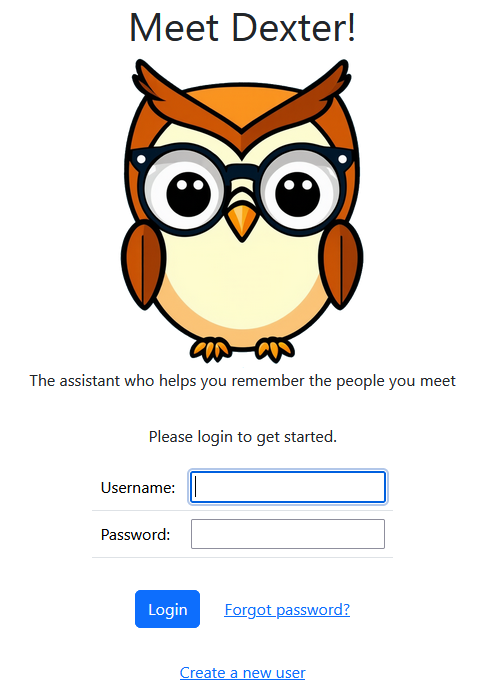
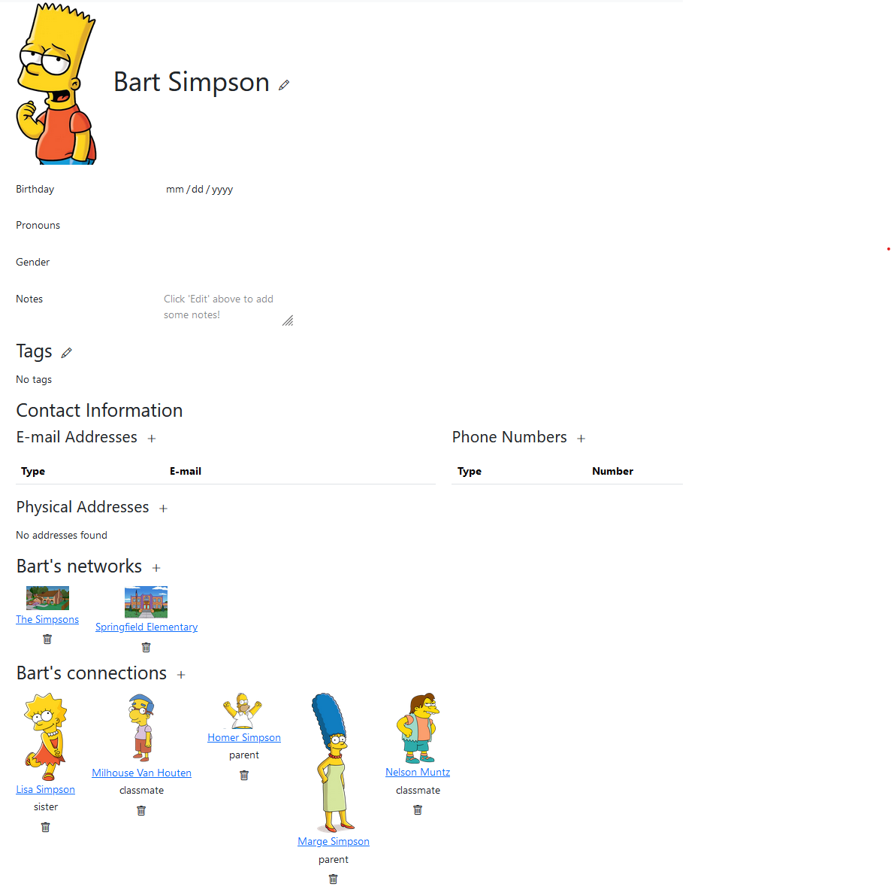
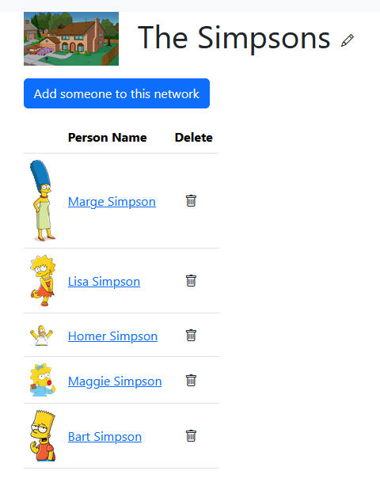
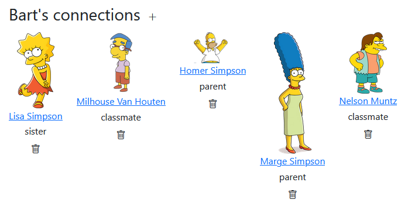

# Dexter

An app to help you remember the people you meet.

## Why Dexter?

It's hard to remember even simple things about the people we meet, especially if we meet lots of people!

### Recall the basics

> "I'm sorry, please remind me of your name again. I feel like I've asked you a hundred times already!"
> 
> -- <cite>Me, every time I run into the parents of my kids' classmates</cite>

Dexter helps you recall simple facts about your acquaintances so you can avoid having to ask about things you feel like you should already know.

### See the context

#### Networks
Dexter helps your organize your acquaintances into networks that you define - schools, work, social groups.

See who else you might run into at work functions, book club, DnD meetup, PTA meetings, anywhere you meet people.

#### Connections

Define relationships between your acquaintances:

> Homer Simpson is the parent of Bart Simpson
> 
> Bart Simpson is the child of Homer Simpson

### Privacy first

Self-host this app and control all your data! Change the way it works and customize it to your needs!